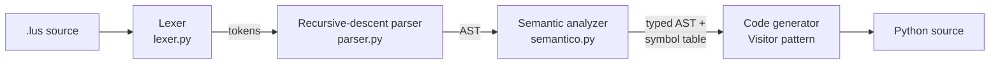

# Lusitano

A statically typed programming language with Portuguese syntax, and a compiler for it written from scratch in pure Python. No parser generators, no external dependencies. Lusitano source is lexed, parsed into an AST, type-checked, and transpiled to runnable Python.

*Uma linguagem de programação com sintaxe em português e seu compilador, escrito do zero em Python.*

```lusitano
funcao fatorial(n: inteiro): inteiro {
    se (n <= 1) {
        retorna 1
    }
    retorna n * fatorial(n - 1)
}

funcao principal() {
    para i de 1 ate 6 {
        escreva(i, "! = ", fatorial(i))
    }
}
```

## Pipeline



| Stage                       | What it does                                                                                                        |
| ----------------------------- | --------------------------------------------------------------------------------------------------------------------- |
| **Lexer**             | Tokenizes source, tracks line/column for every token, reports lexical errors                                        |
| **Parser**            | Hand-written recursive-descent parser with operator precedence; builds an AST of expression and statement nodes     |
| **Semantic analysis** | Symbol table with nested scopes; checks declarations, type compatibility, return types, and assignment to constants |
| **Code generation**   | Visitor over the AST that emits indented, executable Python                                                         |

\~3,300 lines of Python across the four stages.

## Errors that point at the problem

Type and scope errors are reported with exact positions, before any code is generated:

```
╔══════════════════════════════════════════════════════════════╗
║  ERRO SEMÂNTICO na linha 2, coluna 7
╠══════════════════════════════════════════════════════════════╣
║  Tipo incompatível: não é possível atribuir 'texto' a 'inteiro'
╚══════════════════════════════════════════════════════════════╝
```

## Usage

Requires Python 3.10+.

```bash
python lusitano.py Exemplos/08_fatorial.lus              # compile and show generated Python
python lusitano.py Exemplos/08_fatorial.lus --run        # compile and execute
python lusitano.py programa.lus -o programa.py           # write output to a file
```

## Language at a glance

| Lusitano                                          | Meaning                                   |
| --------------------------------------------------- | ------------------------------------------- |
| `var x: inteiro = 10`                         | typed variable declaration                |
| `inteiro` `real` `texto` `logico` | int, float, string, bool                  |
| `se`/`senao`                              | if / else                                 |
| `enquanto`                                    | while                                     |
| `para i de 1 ate 10`                          | for loop over a range                     |
| `funcao nome(a: inteiro): inteiro`            | function with typed parameters and return |
| `retorna`                                     | return                                    |
| `escreva`/`leia`                          | print / input                             |
| `verdadeiro`/`falso`                      | true / false                              |

Full syntax reference: [CHEAT\_SHEET.md](CHEAT_SHEET.md). Fifteen example programs (primes, Fibonacci, multiplication tables, min/max, and more) are in [`Exemplos/`](/Exemplos).

## Documentation

The academic write-up and presentation are in [`docs/`](/docs).

---

Built for the Theory of Computation and Compilers course at UNISUL.

